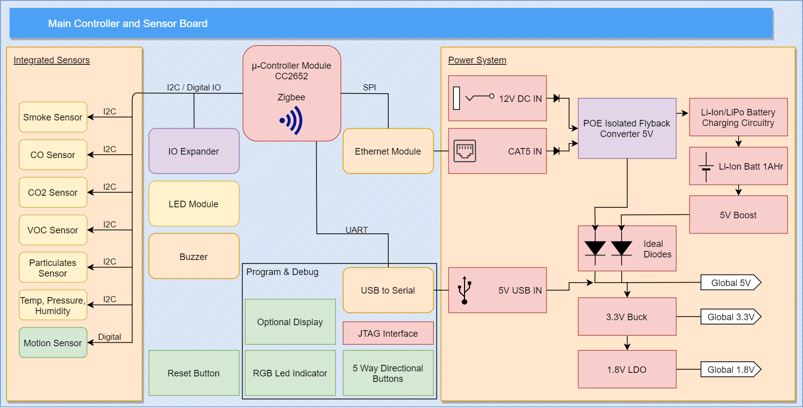

# Electronics
This project contains the main electronics for the SAEMS Senior Design Project. Currently, this consists of a mainboard and an secondary LED daughter board.

## Mainboard
This is the main controller board for the SAEMS project. It's main functionality is the coordination with the Zigbee base station and sensor data acquisition.

### Block Diagram

[Edit on draw.io](https://app.diagrams.net/#HUCF-SAEMS%2FElectronics%2Fmain%2Fsubprojects%2FCree_XML_Driver%2Fdocs%2FSAEMS_MainbaordBlock.png)

### Schematic

### Layout

## Gerbers
Can be found within the Github [repository](build/gerbers).
