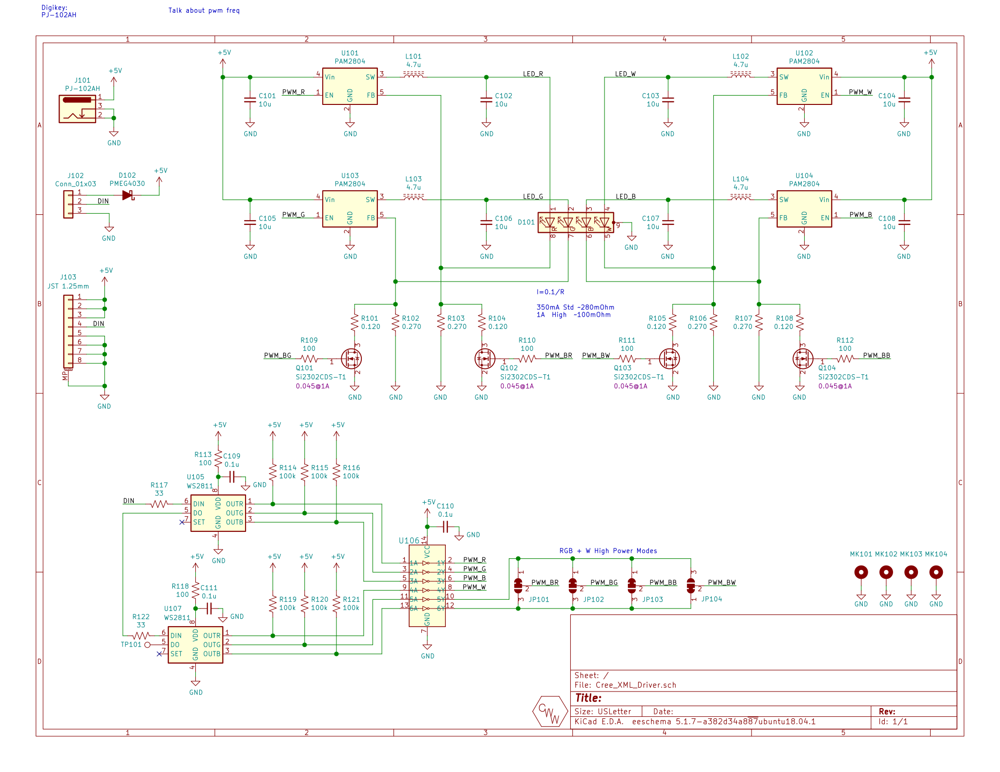

## LED Board / Cree_XML_Driver
This is the high power, RGBW LED driver and integrated module board. It includes 4 constant current buck switchers and a set WS2811's to control the individual brightnesses of each color.

### Schematic

### Layout

## Gerbers
Can be found within the Github [repository](build/gerbers).
