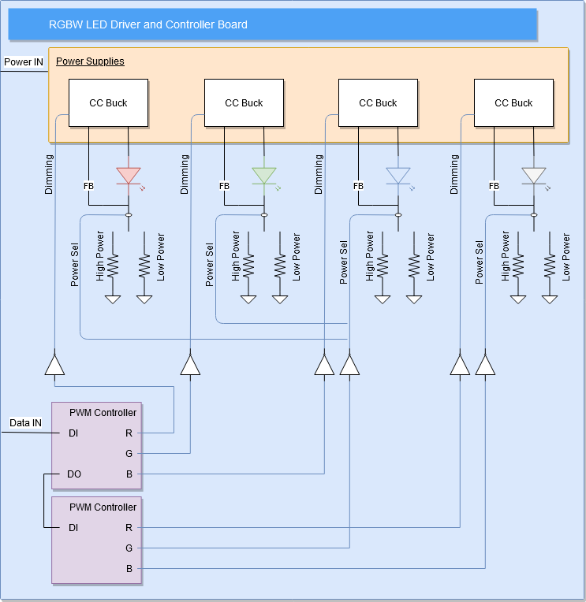

## LED Board / Cree_XML_Driver
This is the high power, RGBW LED driver and integrated module board. It includes 4 constant current buck switchers and a set WS2811's to control the individual brightnesses of each color.

### Flowchart

[Edit on draw.io](https://app.diagrams.net/#HUCF-SAEMS%2FElectronics%2Fmain%2Fsubprojects%2FCree_XML_Driver%2Fdocs%2FSAEMS_LedDriver.png)

### Schematic

### Layout

## Gerbers
Can be found within the Github [repository](build/gerbers).
