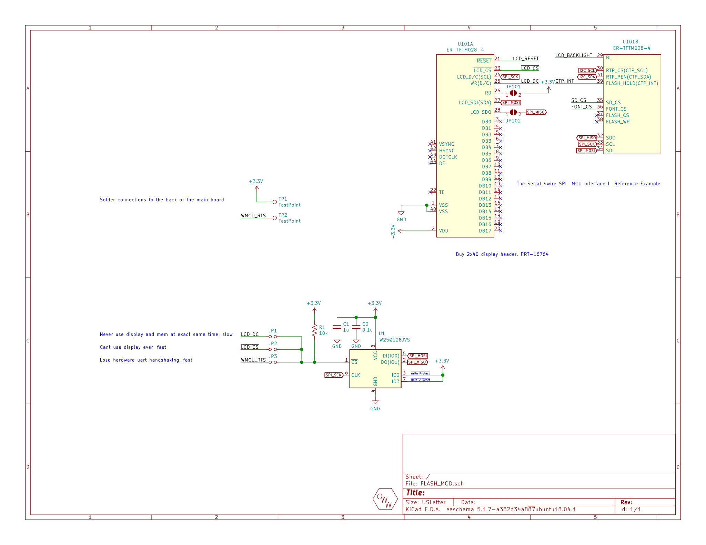

## FLASH_MOD
This is a bit of a hack. The embedded web server and coresponding assets such as html, css, and javascript libraries took more space than expected to host completly locally. To solve this problem, a FLASH_MOD was developed to add additional external flash memory over SPI.

### Schematic

### Layout

## Gerbers
Can be found within the Github [repository](build/gerbers).
